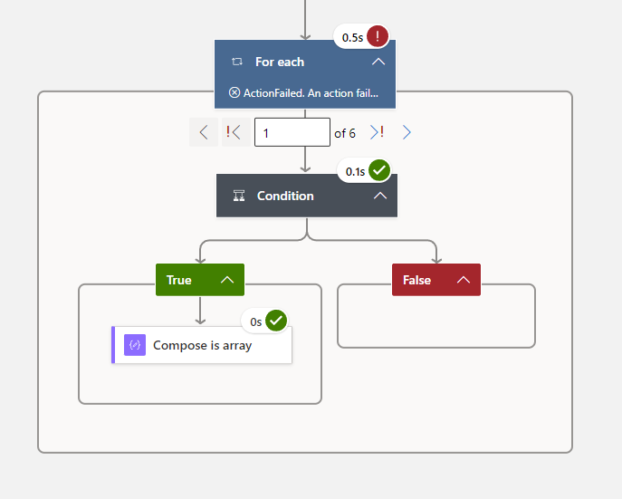

The idea is to read the json file and parse the json payload, for each client, process all the contacts.
A solution is to check the length of the contacts element. If it is an array, the number of elements will be returned otherwise it is an object. 

However, there is no simple way to implement this logic in logic app. The images below shows what happens if this process is implemented as is.

## Contact List is an Array.

## Contact List is an Object.

A better solution will be to use the scope widget as try, catch and finally blocks.

## Try Scope
This contains the condition to check that the element is an array and if it is then compose an output with all the elements.

## Catch Scope
This must be configured to run only if the try scope fails and it involves creating an array of the single element.

## Finally Scope.
In the finally scope, the output from the previous steps have to be coalesced and the scope must be configured to run after the previous step is skipped or is successful.

The approach outline works better than that proposed in the solution to the original question, since it can take advantage of for each loop concurrency.

## Watch a video of the logic app

[Back to Home](README.md)